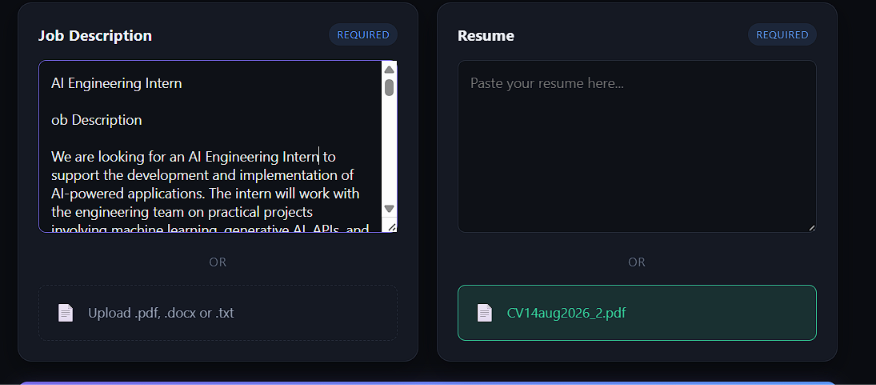
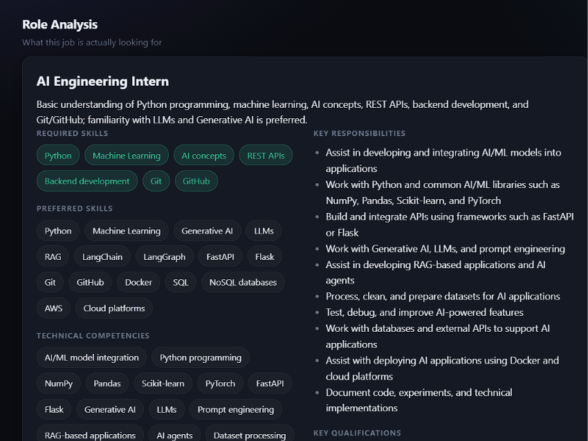
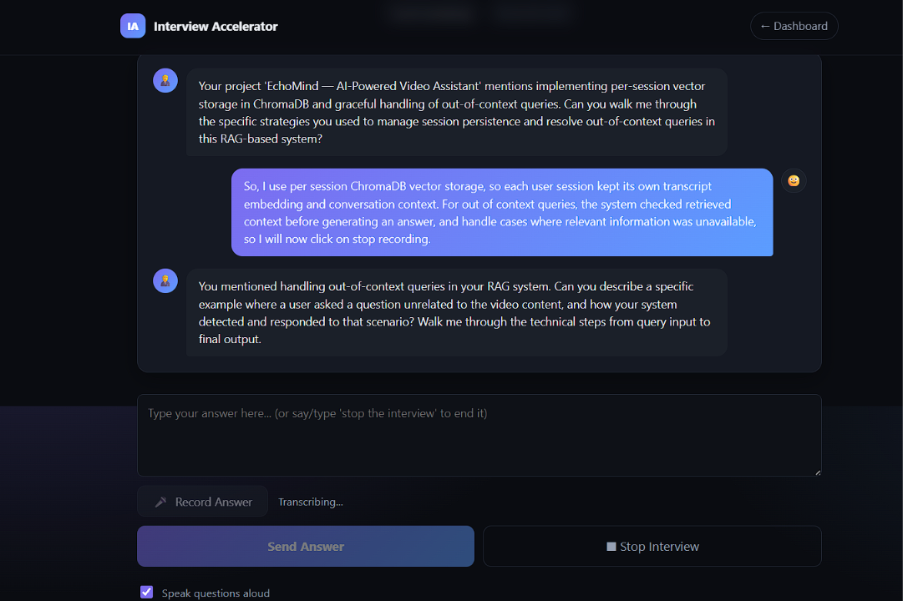
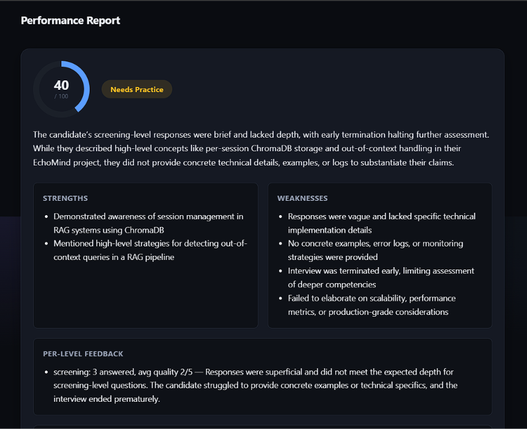
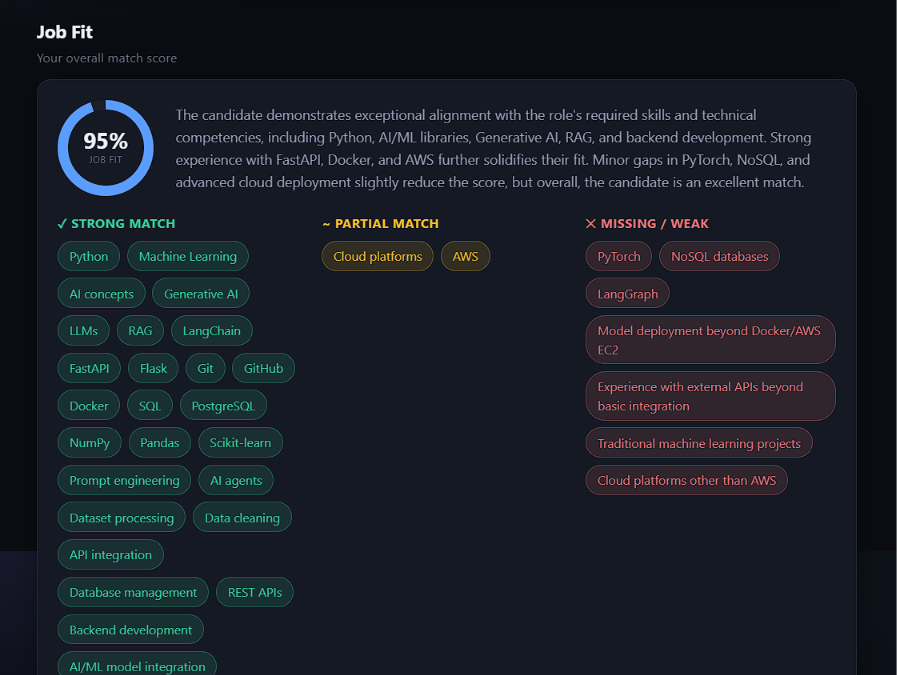

# Interview Accelerator

An AI-powered interview preparation platform. Give it a Job Description and
your Resume, and it tells you exactly how well you match the role, then runs
a real adaptive, voice-based mock interview that gets harder or easier based
on how you're actually doing — and finishes with a detailed performance
report and a prioritized prep plan.

Built for the **AI Product Engineer Intern — Interview Accelerator Challenge**.

---

## Why this exists

A candidate applying for a job usually has a resume and a JD, but no real way
to answer:

- What is this employer actually looking for?
- How well do I actually match?
- What will they ask me, specifically?
- Am I actually ready?

This tool answers all four — using the candidate's own resume and the actual
JD, not generic interview-question banks.
# Interview Accelerator

An AI-powered interview preparation platform. Give it a Job Description and
your Resume, and it tells you exactly how well you match the role, then runs
a real adaptive, voice-based mock interview that gets harder or easier based
on how you're actually doing — and finishes with a detailed performance
report and a prioritized prep plan.

Built for the **AI Product Engineer Intern — Interview Accelerator Challenge**.

🔗 **Live App**: https://interview-accelerator-ahhu.onrender.com
📹 **Demo Video**: [Watch on Google Drive](https://drive.google.com/file/d/17mNoSwgSx_uwf1n0Ype2ps7raPVV0P3K/view?usp=drivesdk)

> Hosted on Render's free tier — the app spins down after ~15 minutes of
> inactivity, so the first request after a while may take 30–60 seconds to
> wake up. Give it a moment on first load.

---

## Why this exists

A candidate applying for a job usually has a resume and a JD, but no real way
to answer:

- What is this employer actually looking for?
- How well do I actually match?
- What will they ask me, specifically?
- Am I actually ready?

This tool answers all four — using the candidate's own resume and the actual
JD, not generic interview-question banks.

## What it does

**1. Understand the role.** Paste or upload a JD → the AI extracts role
title, required/preferred skills, technical and behavioural competencies,
experience expectations, and key qualifications.

**2. Understand the candidate.** Paste or upload a resume → the AI maps it
against the role: strengths, missing skills, weak areas, and specific resume
claims worth probing (e.g. "improved accuracy by 18%" — how did they measure
that?).

**3. Score the fit.** A Job Fit percentage with a clear breakdown: skills that
are a strong match, partial match, and missing/weak — with a short rationale.

**4. Run a real adaptive interview**, not a fixed question list:

| Level | Focus |
|---|---|
| **Screening** | Resume walkthrough, motivation, role fit, communication |
| **Competency** | Technical depth, problem-solving, behavioural competencies, past projects |
| **Deep-Dive** | Follow-ups that challenge vague or weak answers, probe resume claims, test reasoning with "why/how" and scenario questions |

Every question is generated from the candidate's actual resume, the JD, and
their previous answer — the interviewer adapts its next question and its
difficulty based on how the last one went, not from a script.

**5. Voice-native.** Speak your answers instead of typing — the AI transcribes
you, evaluates the answer, and asks its next question out loud. Say "stop the
interview" at any point (typed or spoken) and it ends cleanly.

**6. Performance report.** Overall score, per-level competency breakdown,
strengths, weaknesses, a prioritized preparation plan, and a readiness verdict
(🔴 Not Ready → 🟢 Strong Candidate).

## What's intentionally not included

**Video interview** was a bonus/optional requirement per the brief and was a
deliberate scope decision — the voice experience is the focus here, built to
be solid rather than splitting effort across both.

---

## Tech stack

| Layer | Choice | Why |
|---|---|---|
| Backend | FastAPI (Python) | Async-native, plays well with LLM calls and file uploads |
| LLM | Mistral API (`mistral-small`, with an automatic fallback model) | Fast, cheap, reliable JSON-mode output |
| Speech-to-text | faster-whisper (`tiny`, CPU/int8) | Runs locally, no STT API cost or key |
| Text-to-speech | edge-tts | Free, no API key, natural-sounding voices |
| Frontend | Jinja2 templates + vanilla JS + CSS | No build step, no framework overhead — fast to ship and easy to reason about |
| File parsing | pypdf, python-docx | JD/resume upload as PDF, DOCX, or plain text |
| Session state | In-memory store | Simple for a single-instance prototype; swappable for Redis/Postgres without touching route code |

## Architecture

```
app/
├── main.py                # FastAPI app, route registration, page rendering
├── config.py               # Settings (API keys, model names, voice config) via .env
├── routers/                 # Thin HTTP layer — no business logic lives here
│   ├── ingestion.py         # session creation, JD/resume upload
│   ├── analysis.py          # role/candidate/fit analysis
│   ├── interview.py         # interview start/answer/stop/report
│   └── voice.py             # voice-answer (STT) + TTS endpoints
├── services/                 # All business logic
│   ├── llm.py                # single choke point for every Mistral call
│   ├── extraction.py         # PDF/DOCX/TXT → plain text
│   ├── analysis.py           # role analysis, candidate analysis, job fit scoring
│   ├── interview.py           # the adaptive interview state machine
│   ├── report.py              # deterministic scoring + LLM-written narrative
│   ├── voice.py                # faster-whisper STT, edge-tts TTS
│   └── store.py                 # in-memory session store
├── models/schemas.py            # Pydantic models — the Session object is the
│                                  single source of truth for a candidate's run
├── prompts/                       # every prompt template, kept separate from
│                                  orchestration logic
├── templates/                     # dashboard.html, interview.html
└── static/                         # style.css, app.js, interview.js
```

### How the adaptive interview actually works

One LLM call per answer does double duty: it evaluates the answer just given
(1–5 quality score, plus tags like `weak_area:system_design`) **and**
generates the next question in the same response — grounded in the role
analysis, the candidate's resume, the full transcript so far, and the answer
that was just submitted. That's what makes the follow-up genuinely reactive
instead of pulling from a fixed list.

Level progression (screening → competency → deep-dive → done) is decided by
the model's own `advance_level` signal, but bounded by hard guardrails
(`MIN_QUESTIONS_PER_LEVEL` / `MAX_QUESTIONS_PER_LEVEL`) so a model that's
reluctant to advance — or too eager to end early — can't get the interview
stuck or make it too short.

Three ways an interview can end without waiting for the model to decide it's
done: a spoken/typed stop phrase, the 10-minute wall-clock cap, or the
explicit "Stop Interview" button — all three skip the LLM call entirely and
record why in `ended_reason`.

### How scoring works

Per-answer quality scores (1–5) are set by the LLM during the interview, but
the **overall score and per-level averages are computed deterministically in
code** from those numbers — never re-derived by asking the LLM to average its
own transcript, which is a common source of silent arithmetic drift. The
LLM's only job at report time is the narrative: summary, strengths,
weaknesses, per-level feedback text, and the improvement plan — all grounded
in the transcript and the computed stats it's given.

Readiness bands: **80+** Strong Candidate · **60–79** Interview Ready ·
**40–59** Needs Practice · **<40** Not Ready.

---

## Running it locally
## What it does

**1. Understand the role.** Paste or upload a JD → the AI extracts role
title, required/preferred skills, technical and behavioural competencies,
experience expectations, and key qualifications.

**2. Understand the candidate.** Paste or upload a resume → the AI maps it
against the role: strengths, missing skills, weak areas, and specific resume
claims worth probing (e.g. "improved accuracy by 18%" — how did they measure
that?).

**3. Score the fit.** A Job Fit percentage with a clear breakdown: skills that
are a strong match, partial match, and missing/weak — with a short rationale.

**4. Run a real adaptive interview**, not a fixed question list:

| Level | Focus |
|---|---|
| **Screening** | Resume walkthrough, motivation, role fit, communication |
| **Competency** | Technical depth, problem-solving, behavioural competencies, past projects |
| **Deep-Dive** | Follow-ups that challenge vague or weak answers, probe resume claims, test reasoning with "why/how" and scenario questions |

Every question is generated from the candidate's actual resume, the JD, and
their previous answer — the interviewer adapts its next question and its
difficulty based on how the last one went, not from a script.

**5. Voice-native.** Speak your answers instead of typing — the AI transcribes
you, evaluates the answer, and asks its next question out loud. Say "stop the
interview" at any point (typed or spoken) and it ends cleanly.

**6. Performance report.** Overall score, per-level competency breakdown,
strengths, weaknesses, a prioritized preparation plan, and a readiness verdict
(🔴 Not Ready → 🟢 Strong Candidate).

## What's intentionally not included

**Video interview** was a bonus/optional requirement per the brief and was a
deliberate scope decision — the voice experience is the focus here, built to
be solid rather than splitting effort across both.

---

## Screenshots

### Dashboard


### Role Analysis


### AI Interview


### Candidate Analysis & Job Fit



### Job Fit By Resume


---

## Tech stack

| Layer | Choice | Why |
|---|---|---|
| Backend | FastAPI (Python) | Async-native, plays well with LLM calls and file uploads |
| LLM | Mistral API (`mistral-small`, with an automatic fallback model) | Fast, cheap, reliable JSON-mode output |
| Speech-to-text | faster-whisper (`tiny`, CPU/int8) | Runs locally, no STT API cost or key |
| Text-to-speech | edge-tts | Free, no API key, natural-sounding voices |
| Frontend | Jinja2 templates + vanilla JS + CSS | No build step, no framework overhead — fast to ship and easy to reason about |
| File parsing | pypdf, python-docx | JD/resume upload as PDF, DOCX, or plain text |
| Session state | In-memory store | Simple for a single-instance prototype; swappable for Redis/Postgres without touching route code |
| Deployment | Render (Web Service, Free tier) | Simple Python deploys with env-var secrets management |

## Architecture

```
app/
├── main.py                # FastAPI app, route registration, page rendering
├── config.py               # Settings (API keys, model names, voice config) via .env
├── routers/                 # Thin HTTP layer — no business logic lives here
│   ├── ingestion.py         # session creation, JD/resume upload
│   ├── analysis.py          # role/candidate/fit analysis
│   ├── interview.py         # interview start/answer/stop/report
│   └── voice.py             # voice-answer (STT) + TTS endpoints
├── services/                 # All business logic
│   ├── llm.py                # single choke point for every Mistral call
│   ├── extraction.py         # PDF/DOCX/TXT → plain text
│   ├── analysis.py           # role analysis, candidate analysis, job fit scoring
│   ├── interview.py           # the adaptive interview state machine
│   ├── report.py              # deterministic scoring + LLM-written narrative
│   ├── voice.py                # faster-whisper STT, edge-tts TTS
│   └── store.py                 # in-memory session store
├── models/schemas.py            # Pydantic models — the Session object is the
│                                  single source of truth for a candidate's run
├── prompts/                       # every prompt template, kept separate from
│                                  orchestration logic
├── templates/                     # dashboard.html, interview.html
└── static/                         # style.css, app.js, interview.js
```

### How the adaptive interview actually works

One LLM call per answer does double duty: it evaluates the answer just given
(1–5 quality score, plus tags like `weak_area:system_design`) **and**
generates the next question in the same response — grounded in the role
analysis, the candidate's resume, the full transcript so far, and the answer
that was just submitted. That's what makes the follow-up genuinely reactive
instead of pulling from a fixed list.

Level progression (screening → competency → deep-dive → done) is decided by
the model's own `advance_level` signal, but bounded by hard guardrails
(`MIN_QUESTIONS_PER_LEVEL` / `MAX_QUESTIONS_PER_LEVEL`) so a model that's
reluctant to advance — or too eager to end early — can't get the interview
stuck or make it too short.

Three ways an interview can end without waiting for the model to decide it's
done: a spoken/typed stop phrase, the 10-minute wall-clock cap, or the
explicit "Stop Interview" button — all three skip the LLM call entirely and
record why in `ended_reason`.

### How scoring works

Per-answer quality scores (1–5) are set by the LLM during the interview, but
the **overall score and per-level averages are computed deterministically in
code** from those numbers — never re-derived by asking the LLM to average its
own transcript, which is a common source of silent arithmetic drift. The
LLM's only job at report time is the narrative: summary, strengths,
weaknesses, per-level feedback text, and the improvement plan — all grounded
in the transcript and the computed stats it's given.

Readiness bands: **80+** Strong Candidate · **60–79** Interview Ready ·
**40–59** Needs Practice · **<40** Not Ready.

---

## Running it locally

```bash
git clone <your-repo-url>
cd interview-accelerator
git clone <your-repo-url>
cd ass_3
python -m venv venv
source venv/bin/activate      # Windows: venv\Scripts\activate
source venv/bin/activate      # Windows: venv\Scripts\activate
pip install -r requirements.txt


cp .env.example .env
# edit .env and set MISTRAL_API_KEY to your own key

# edit .env and set MISTRAL_API_KEY to your own key

uvicorn app.main:app --reload
```

Open **http://127.0.0.1:8000**.

> First voice answer will be slower than the rest — faster-whisper downloads
> and loads its model (~75MB for `tiny`) on first use, then stays warm.
> Decoding the browser's webm/opus recordings needs `ffmpeg`/`libav`
> available on your system PATH.

### Environment variables

| Variable | Default | Notes |
|---|---|---|
| `MISTRAL_API_KEY` | — | **Required.** Get one from Mistral's console. |
| `MISTRAL_MODEL` | `mistral-small-2603` | Primary model for all analysis/interview/report calls |
| `MISTRAL_FALLBACK_MODEL` | `mistral-small-latest` | Tried once if the primary model's retries are exhausted |
| `WHISPER_MODEL_SIZE` | `tiny` | CPU-friendly; `tiny.en` also works |
| `TTS_VOICE` | `en-US-GuyNeural` | Any edge-tts voice name |

## Using it

1. **Dashboard** (`/`) — paste or upload your JD and resume → **Analyse My
   Fit**. You'll get the role breakdown, candidate breakdown, and Job Fit
   score.
2. Click **Start AI Interview →**.
3. Answer by typing or by clicking **🎤 Record Answer**. Toggle "Speak
   questions aloud" to hear the interviewer.
4. Click **⏹ Stop Interview** any time, or just keep going until the AI ends
   it naturally after the deep-dive level.
5. Your **Performance Report** appears automatically once the interview ends
   — score, competency breakdown, strengths/weaknesses, and a prioritized
   prep plan.

Session state is in-memory, so it resets on server restart — fine for a
single-run prototype/demo; swap `app/services/store.py` for Redis/Postgres if
you need persistence across restarts.

## Known limitations

- Sessions are in-memory only (no persistence across restarts).
- Voice quality depends on the `tiny` Whisper model — smaller/faster, so
  occasionally less accurate than larger Whisper variants on noisy audio.
- No video interview (see "What's intentionally not included" above).
- Single-user prototype — no auth, no multi-tenant session isolation beyond
  the per-session UUID.

Open **http://127.0.0.1:8000**.

> First voice answer will be slower than the rest — faster-whisper downloads
> and loads its model (~75MB for `tiny`) on first use, then stays warm.
> Decoding the browser's webm/opus recordings needs `ffmpeg`/`libav`
> available on your system PATH.

### Environment variables

| Variable | Default | Notes |
|---|---|---|
| `MISTRAL_API_KEY` | — | **Required.** Get one from Mistral's console. |
| `MISTRAL_MODEL` | `mistral-small-2603` | Primary model for all analysis/interview/report calls |
| `MISTRAL_FALLBACK_MODEL` | `mistral-small-latest` | Tried once if the primary model's retries are exhausted |
| `WHISPER_MODEL_SIZE` | `tiny` | CPU-friendly; `tiny.en` also works |
| `TTS_VOICE` | `en-US-GuyNeural` | Any edge-tts voice name |

## Using it

1. **Dashboard** (`/`) — paste or upload your JD and resume → **Analyse My
   Fit**. You'll get the role breakdown, candidate breakdown, and Job Fit
   score.
2. Click **Start AI Interview →**.
3. Answer by typing or by clicking **🎤 Record Answer**. Toggle "Speak
   questions aloud" to hear the interviewer.
4. Click **⏹ Stop Interview** any time, or just keep going until the AI ends
   it naturally after the deep-dive level.
5. Your **Performance Report** appears automatically once the interview ends
   — score, competency breakdown, strengths/weaknesses, and a prioritized
   prep plan.

Session state is in-memory, so it resets on server restart — fine for a
single-run prototype/demo; swap `app/services/store.py` for Redis/Postgres if
you need persistence across restarts.

## Known limitations

- Sessions are in-memory only (no persistence across restarts).
- Voice quality depends on the `tiny` Whisper model — smaller/faster, so
  occasionally less accurate than larger Whisper variants on noisy audio.
- No video interview (see "What's intentionally not included" above).
- Single-user prototype — no auth, no multi-tenant session isolation beyond
  the per-session UUID.
- Deployed on Render's free tier — spins down when idle, so the first request
  after inactivity is slow (~30–60s cold start).
```


1. **Screenshot filenames** — I used `dashboard.png`, `role-analysis.png`, `candidate-analysis.png`, `interview.png`, `report.png`. Rename your actual files to match, or tell me the real names and I'll fix the paths.
2. **Google Drive sharing setting** — make sure it's set to "Anyone with the link can view," not restricted, or the evaluator won't be able to open it.